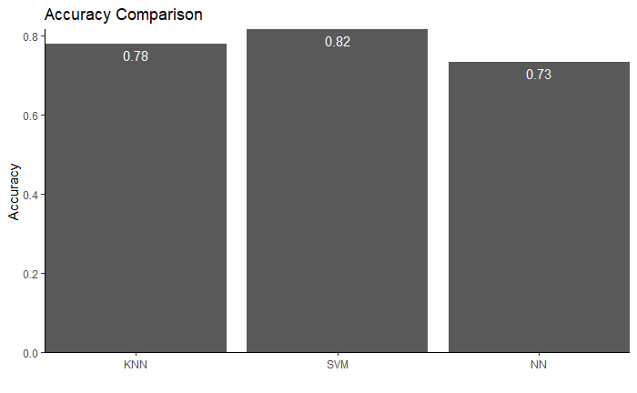

# language-classifier
Comparing the accuracy of different classification algorithms using language data.

Access the analysis by opening the "language_classifier.ipynb" file or the "language_classifier.Rmd" file.

The following are the results from the R file; I was having issues running my R code in Jupyter Notebook, so it was much harder to display than the Python code.

This was significantly harder to implement in R than it was in Python due to the data preprocessing and model building. The KNN and SVM turned out well enough, although the SVM's confusion matrix isn't great. I would definitely choose to use the SVM model to make future predictions. As for the NN - well, someday I'll figure out how to implement it. I don't know what it was about it, but the only way I got it to work, it ended up predicting "0" for everything. Maybe it's a simple fix - I'll look more into it later. I'll also work on adding an ROC curve, but right now I have to study for midterms.
